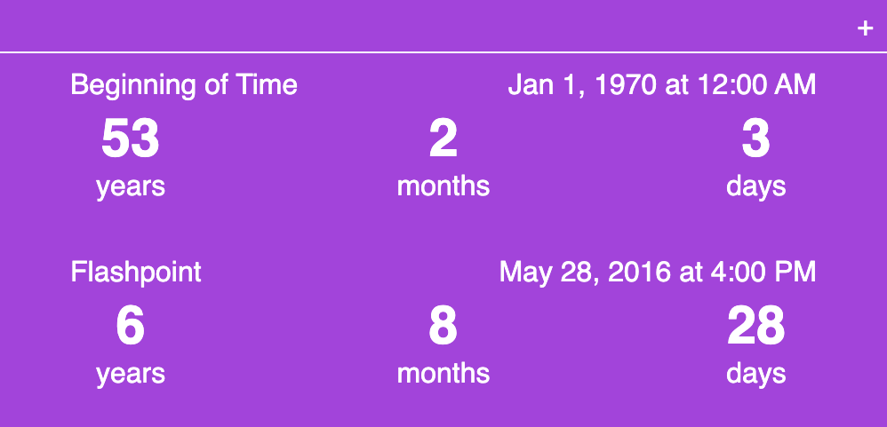

# Flock

A countdown application, built with [SvelteKit](https://kit.svelte.dev/docs/introduction).

Available at [https://flockclock.vercel.app](https://flockclock.vercel.app/), hosted on [Vercel](https://vercel.com).

### Features
- Create and manage countdowns
- Intelligently displays the remaining time left
- Count "up" from a date once it has past
- Share Flocks with friends 

### Built With
- [SvelteKit](https://kit.svelte.dev/docs/introduction)
- [Day.js](https://day.js.org)
- [Vercel](https://vercel.com)
